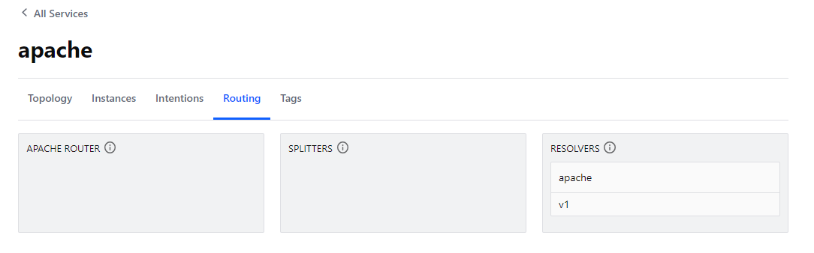
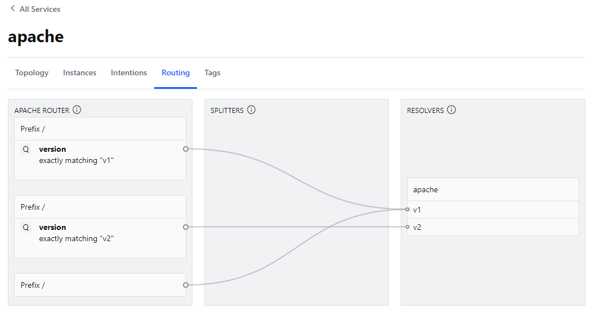
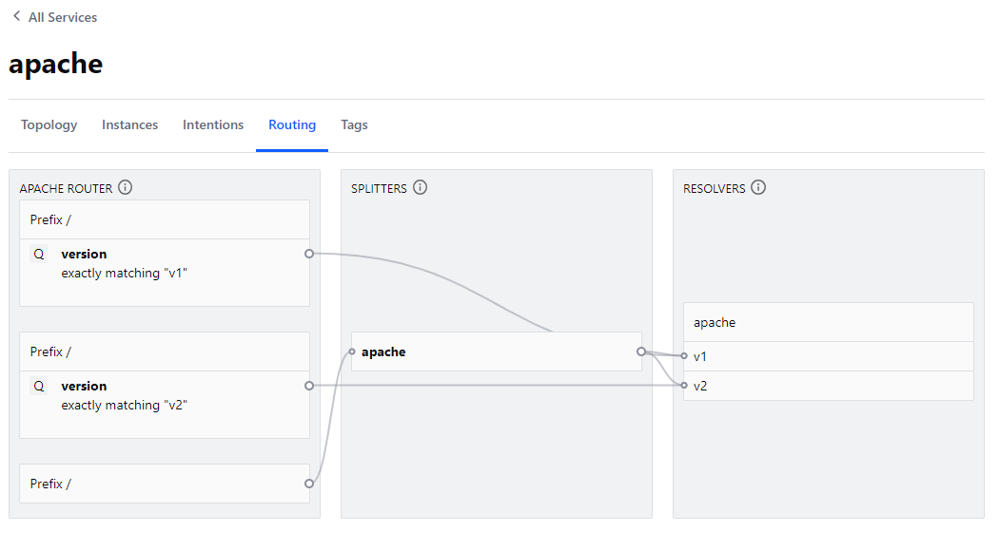

# L7 traffic management
Now all our microservices are in the service mesh we will look at deploying a v2 of the apache service. The only 
difference in the v2 service is the `h1` header, we append "v2" to it, so we can distinguish between the two versions.

## east-west traffic
In order to use things like service routers which apply to east-west traffic we will re-configure the api-gateway to 
send traffic to a new nginx instance which will then route east-west traffic and make sure of L7 traffic.

```bash
kubectl apply -f traffic-management/reconfigure-api-gateway-entry.yaml
```

## Send Traffic
I have created a small send traffic script. It will just send 100 requests to the api-gateway and print the h1 html tag.
This will allow us to see what's happening with traffic requests when we start applying things like resolvers, routers and
splitters

```bash
$ sh traffic-management/send_traffic.sh

################
#  summary     #
################
    100         <h1>Order Processing</h1>
```

we will use a snippet like above to show the traffic differences as we apply the different traffic management rules.

## apache-v2
We will now deploy the apache-v2 instance. This service is the same as the apache service but with a different `h1`. 
However, it will register to consul with the same service name as the original apache service. This has pro's and con's,
it means that downstream services dont need to make any changes to target the new service, but it also means that we will
be routing traffic across v1 and v2 instances which likely isnt what we want. So for now we wont deploy the v2 service

## Service Resolver
Service resolvers specify which instances of a service satisfy discovery requests for the provided service name. Service resolvers enable several use cases, including:

* Designate failovers when service instances become unhealthy or unreachable.
* Configure service subsets based on DNS values.
* Route traffic to the latest version of a service.
* Route traffic to specific Consul datacenters.
* Create virtual services that route traffic to instances of the actual service in specific Consul datacenters.

In our case we will use the service resolver to create subsets of the apache service. We will use the metadata of the 
apache instances to group them into subsets. We will set the default subset to be the v1 instances to ensure traffic 
continues to work the same way even after we bring v2 up.

```bash
kubectl apply -f traffic-management/router.yaml
kubectl apply -f traffic-management/apache-v2.yaml
```



Running the traffic script we can see that while v2 is up and is a healthy instance of the apache service, traffic is still
being routed to the v1 instances. This is because we have set the default subset to be the v1 instances. We can see this
with the traffic script

```bash
$ sh traffic-management/send_traffic.sh

################
#  summary     #
################
    100         <h1>Order Processing</h1>
```

## Service Router
Routers intercept traffic according to a set of L7 attributes, such as path prefixes and HTTP headers, and route the 
traffic to a different service or service subset. In this demo we will use a query parameter called version to route to 
the service subsets. 

```bash
kubectl apply -f traffic-management/router.yaml
```

Looking at the UI we can now see the router has been applied.



If we run the traffic service with no parameters we see we still have the same behaviour which is all traffic to v1. But
if we pass the send_traffic script the parameter v2 we can see it routes to the v2 service.

**Default Behaviour**
```bash
$ sh traffic-management/send_traffic.sh

################
#  summary     #
################
    100         <h1>Order Processing</h1>
```

**V2 Behaviour**
```bash
$ sh traffic-management/send_traffic.sh v2

################
#  summary     #
################
    100 <h1>Order Processing - v2</h1>
```

## Service Splitter
Service splitters split incoming requests and route them to different services or service subsets. Splitters enable 
staged canary rollouts, versioned releases, and similar use cases.

In our demo we are going to apply a cannary deployment where we will route 20% of the traffic to the v2 service. 

```bash
kubectl apply -f traffic-management/spliiter-80-20-only.yaml
```

Looking at the UI we can see the splitter will split traffic between v1 and v2 instances as well as still having the 
service router in place. splitters only apply to the default routing path. 



We will run the send traffic script to observe the splitter. The splitter is not assured to be 100% accurate but with 
the law of large numbers the more requests we send the closer we should get to 80/20 split.

```bash
$ sh traffic-management/send_traffic.sh

################
#  summary     #
################
     81         <h1>Order Processing</h1>
     19 <h1>Order Processing - v2</h1>
```

